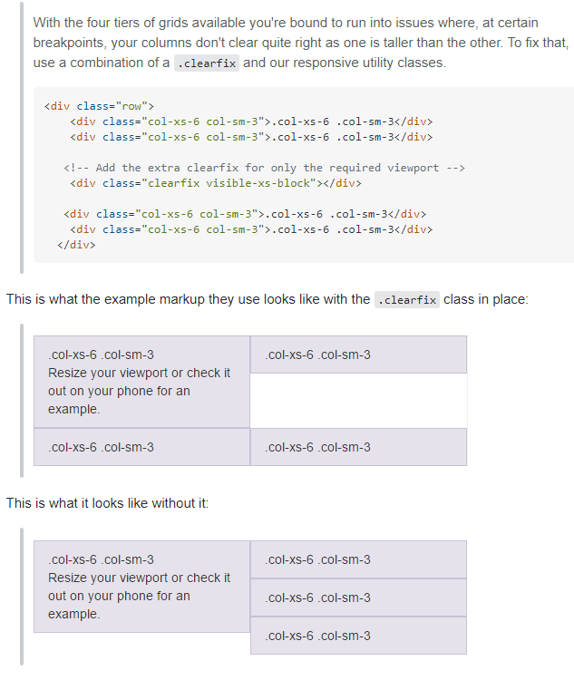

# PATİKA.DEV FRONT-END EĞİTİMİ
Başlangıç Tarihi 09/04/2021 15:08   
Yazan: Cengizhan Parlak [GitHub](https://github.com/cengizhanparlak)

## *İçerik* 

## 1) [Patika eğitim notları](#patika-notlar)

* [Araçlar, IDE Ayarları, Eklentiler, Emmets](#notlar-araclar)
  * [Yararlı VS Code kısayolları](#notlar-kisayollar)
  * [IDE Ayarları](#notlar-ide-ayarlar)
  * [Emmet Kısayolları](#notlar-emmet)
* [HTML](#notlar-html)
* [CSS](#notlar-css)
* [Bootstrap](#notlar-bootstrap)
* [JavaScript](#notlar-js)

## 2) [Patika eğitimi için kaynaklar](#patika-kaynaklar)

* [Yardımcı Araçlar, IDE Ayarları, Eklentiler](#kaynaklar-araclar)
  * [VS Code Eklentileri](#kaynaklar-eklentiler)
  * [Uygulamalar ve Web Siteleri](#kaynaklar-siteler)
* [HTML](#kaynaklar-html)
* [CSS](#kaynaklar-css)
* [Bootstrap](#kaynaklar-bootstrap)
* [JavaScript](#kaynaklar-js)

# PATİKA.DEV FRONT-END EĞİTİMİ NOTLARI  [&#8593;](#icerik) 

Eğitim süresince görülen derslerde alınan notlar yer almaktadır. IDE kullanımı üzerine kısayollar da dahil olmak üzere "faydalı" olduğuduna inandığım çoğu bilgi burada almakta.

# Araçlar, IDE Ayarları, Eklentiler  [&#8593;](#icerik) 

Kod yazımında kullanılan ek araçlar, kullanımları üzerine notlar. IDE Ayarları ve eklentiler; nasıl kullanılması gerektiği ve özellikleri hakkında notlar

## Yararlı VS Code kısayolları  
* `Ctrl + Shift + E` dosya panelini açar
* `Ctrl + Shift + G` source control panelini açar
* `Ctrl + Shift + X` eklenti marketini açar
* `Ctrl + Shift + P` VS Code ayarlarında arama yapmanızı sağlar
* `Ctrl + P` workspace içindeki dosya ve klasörleri aramanızı sağlar
* `Ctrl + Shift + N` yeni bir VS Code penceresi açar
* `Ctrl + Shift + "` dahili terminali açar
* `Ctrl + Shift + C` harici terminali (windows cmd) açar
* `Ctrl + B`  sidebar'ı kapatıp açabilirsiniz
* `Ctrl + K V` kısayolu ile sağ kısımda yeni ön izleme açılabilir
* `Ctrl + Shift + V` kısayolu ile ön izleme aynı tab grubunda açılır
* `Ctrl + Shift + K` satır silinir
* `Alt + Shift + F` ile kod düzenlemesi yapılabilir.
* `Ctrl + K + C` ile satır yorum satırı haline getirilir.
* `Ctrl + K + U` ile satırdaki 1 yorum kaldırılır.
* `Ctrl + Space` ile IntelliSense'in olduğu herhangi bir editörde o satır için önerilenler kısmını tekrar açabilirsiniz.
* `Ctrl + 1/2/3` tab grupları arasında gezinti yapmayı sağlar
* `Ctrl + Alt + sağ/sol ok` açık olan tabı sağ gruba taşır. sağda açık grup yoksa ekranı ikiye böler ve yeni grup açar
* `Alt + LClick` seçilen sayıda satırdaki yeri aynı anda değiştirmek için kullanılır. (Multiline editing)
* 

    
Closing tag'e gitmek için

    
  

## IDE AYARLARI 

* `Ctrl + N` ile bulunduğunuz klasörde hızlıca dosya açmak için şu adımlar yapılmalı
  1. VS Code ayarlarında (`Ctrl + Shift + P`) şu dosyayı aratıp açın 
  
         Preferences: Open Keyboard Shortcuts (JSON)
  2. Aşağıdaki kodu yapıştırıp dosyayı kaydedin
        
          [
            { 
              "key": "ctrl+n", 
              "command": "explorer.  newFile" },
           ]
           
* `Ctrl + Alt + N` ile workspace'de hızlıca klasör yaratmak için yukarıdaki adımı takip edin. 2. adımda süslü parantezden virgül koyup şu kodu ekleyin 

      { 
        "key": "ctrl+alt+n", 
        "command": "explorer.newFolder" },
  
  Her ikisini de eklediyseniz kod şöyle olmalı 
  
      [
          { 
          "key": "ctrl+n", "command": "explorer.newFile" }, 
          { 
          "key": "ctrl+alt+n", "command": "explorer.    newFolder" },
      ]

*   `Ctrl + Tab` ve `Ctrl + Shift + Tab` ile sırayla sekme gezintisi yapmak için `settings.json` içine ekleyin 

        {
            "key": "ctrl+tab", 
            "command": "workbench.action.nextEditorInGroup" },
        {
            "key": "ctrl+shift+tab",
            "command": "workbench.action.previousEditorInGroup" },

## Emmet 

*  ^ işareti parantezli artı görevi görür

       .row>.col-sm>(h2>lorem1)+(p>lorem6)+(a>.btn)
       .row>.col-sm>h2>lorem1^p>lorem6^a>.btn
    aynı anlama gelir
* 

# HTML   [&#8593;](#icerik) 
* Dil alakasız notlar  
  * "! + Enter" kısayolunu VS Code'da çalıştırmak için açılan `.html` uzantılı dosyanın Language Mode'u HTML olarak seçilmelidir. (Varsayılan olarak django-html seçilme ihtimalinden dolayı.)
  * `.html` uzantılı dosyalar için html modunu bir ve son kez değiştirmek için: 
    1. Aşağıdaki mavi bardan HTML kısmına tıklayın.
    2. Yukarıda açılan bölümde Configure File Association for '.html' seçeneğine tıklayın
    3. Arama kısmına "html" yazarak html seçeneğini varsayılan dosya konfigürasyonu olarak belirleyin.

* Dille alakalı notlar 
  * HTML'de Semantic Markup ve Presentational Markup olmak üzere 2 çeşit işaretleme bulunabilir:
    * Presentational Markup: Gösterimsel İşaretleme anlamına gelir ve etiketlemenin yalnızca "görünüş olarak" özelliklerinin değiştirildiğini belli eder.
      
    * Semantic Markup: Anlamsal İşaretleme anlamına gelir ve etiketleme yapılan özelliğin, HTML kodlarını yorumlayan farklı web siteleri, araçlar ve uygulamalar tarafından anlam olarak da önem kazandığına işaret eder. (örneğine Semantic Markup ile işaretlenmiş bir etiketin ekran okuyucusunda vurgulanması gibi)

    İki işaretleme arasında SEO olarak ise bir fark yoktur. [Link](https://youtu.be/awto_wCeOJ4 "Is there a difference between the `strong` and `b` tags in terms of SEO?")
    * `<strong>` ve `<b>` kapamalı etiketlerinin farkı bulunamkta. Arama motorları ve HTML kodunu yorumlayan, inceleyen araçlar için `<strong>` etiketi metnin önemini belirtir. `<b>` etiketi ise sadece metni kalınlaştırır. `<strong>` etiketi metnin, ekran okuyucular tarafından "nasıl" okunması gerektiği konusunda bilgi verir.
    
    * `style` HTML dökümanı işlenirken ve görüntülenirken sayfa sırayla işlendiği için her zaman sırasıyla en altta kalan stil belirlemeleri baskın gelecektir. (Aynı element için birden fazla style olması durumunda)
  *  `id` attribute'u HTML sayfası boyunca yalnızca 1 öğeye verilebilir. Daha sonra bu öğeye spesifik olarak erişmekte kullanılabilir.
  *  `class` attribute'u HTML sayfası boyunca aynı özellikleri taşıması istenen (aynı sınıfta olması gereken) öğelere verilir. Birden çok öğeye verilebilir. Her birinde değiştirmek istediğimiz bir özellik olduğunda hepsini kolayca tek bir class ismiyle değiştirebiliriz.
  * Googl Font'larını siteye koyarken html'e eklediğimiz `<link>` tag'ı `head` içinde ilk satırda yer almalı.

## CSS  [&#8593;](#icerik)

* Dil alakasız notlar

* Dille alakalı notlar
  * Bir HTML elementi kendini kapsayan elementin (parent elementi) stil özelliklerine sahip olur.
  * Google Font'larını siteye eklerken `@import` yerine `<link>` tagını kullanmalısınız. Performans olarak link tercih edilmekte ve önerilmekte.
    ## Seçiciler
  *     div *{
        color: black;
        } 
    diyerek tüm div elementleri içindeki elementlerin yazı rengine erişmiş olduk.
  *     margin: 100px 150px 60px 50px;  /* top right bottom left* olarak gider. saat 12 yönünden sağa doğru */
    diyerek tüm div elementleri içindeki elementlerin yazı rengine erişmiş olduk.
  *     div *{
        color: black;
        } 
    diyerek tüm div elementleri içindeki elementlerin yazı rengine erişmiş olduk.
  *     div *{
        color: black;
        } 
    diyerek tüm div elementleri içindeki elementlerin yazı rengine erişmiş olduk.  
    
## Bootstrap  [&#8593;](#icerik)
  * 
  * 
  * Bootstrap tasarımındaki kolonlar 12'den fazla olursa; görünüme sığmayacağı için (bloğu bozacağı için) alta geçerler.
  * Bootstrap 5'ta: sol boşluk için `col-4 ms-auto` ve sağ boşluk için `col-4 me-auto` kullanılır. (`ms`: margin start, `me`: margin end)
  * [Bootstrap Containers](https://getbootstrap.com/docs/4.4/layout/overview/#containers "")  
  Container: içerikleri koyduğumuz bootstrap yapısı. Çerçeve olarak düşünülebilir. 

    
  * 
  * 
  * [Grid Examples (w3schools)](https://www.w3schools.com/bootstrap4/bootstrap_grid_examples.asp#:~:text=col%2Dsm%2D%20(small%20devices,to%20or%20greater%20than%20992px))
  * `col-sm-6 col-md-4 col-lg-3` class ismi
    >small cihazlarda 12/6=2 grid medium cihazlarda 12/4=3 gridlik yer kaplar. 
  * `col-sm-6` ve benzeri boyut isimlendirmeleri:
    > belirtilen boyuttan sonraki tüm cihazlarda 6 gridlik yer kapla anlamına gelir
  * 
  * `col-sm-6` ve benzeri isimlendirme başlamak kural gibi bir şey. Telefon boyutlarından dolayı sadece 1 içerik olmalı.
  * row içindeki
     > `class="col-6"`
     `class="col-6"`
     ile 2 column 6 hücre kaplayan 2 bölge oluşturulur
    
    > `class="col"`
     `class="col"` da 6 gridlik 2 bölge oluşturur.

     >`class="row"`, içinde yazdığımız col sayısı kadar bölünme yaşar
  * 

    
`.flexbox` kullanım sebebi

    
  

  
  * Hangi öğelerin hangi ekranda gözükeceği: `display` ile doc'ta bulunabilir.
  * `offset-sm-2` ve benzeri kullanımlarda her zaman baştan boşluk verilir.
    * aynı row içerisinde farklı elementlere `offset` verince hepsinin offset boşluğu soldan başlar.

## JavaScript  [&#8593;](#icerik) 

* 

# PATİKA.DEV FRONT-END EĞİTİMİ İÇİN KAYNAKLAR  [&#8593;](#icerik) 

Bu başlık altında kullanılabilecek kaynaklar yer almaktadır. Yararlı VS Code eklentileri, site tasarlamasında kullanılabilecek yardımcı araçlar, web siteleri; yapılması gereken IDE ayarları da bu başlıkta yazılmıştır.

# Yardımcı Araçlar, IDE Ayarları, Eklentiler  [&#8593;](#icerik)

  * ## VS Code Eklentileri 

    * Live Preview [link](https://marketplace.visualstudio.com/items?itemName=tht13.html-preview-vscode "HTML Preview") (HTML dosyasında yaptığınız değişiklikleri VS Code üzerinde canlı olarak görebilirsiniz. `Ctrl + K V` kısayolu ile sağ kısımda ön izleme açabilirsiniz)
    * Paste Image [link](https://marketplace.visualstudio.com/items?itemName=mushan.vscode-paste-image "Paste Image") (`Ctrl + Alt + V` ile ekran görüntülerini markdown dosyalarına doğrudan yapıştırabilirsiniz)
      * Resimlerin "images" adındaki klasöre kaydedilmesi için eklenti ayarlarına gidin. "Path" kısmında:
        >`${currentFileDir}` yerine `${currentFileDir}/images}`yazın
      * Resmin kaydedildiği adı değiştirmek için: resmin ismini yazın. Sonra bunu fareyle seçin ve `Ctrl + Alt + V` yapın. Resim fareyle seçtiğiniz isimle kaydedilecektir
  
    * TabNine [link](https://marketplace.visualstudio.com/items?itemName=TabNine.tabnine-vscode&ssr=false "Autocomplete my TabNine")

* ## Uygulamalar ve Web Siteleri 

  * 

## HTML   [&#8593;](#icerik)

* 

## CSS  [&#8593;](#icerik) 

* 

## Bootstrap  [&#8593;](#icerik) 

* [Bootstrap Documentation](https://getbootstrap.com/docs/5.0/getting-started/introduction/)
* [Bootstrap Components](https://getbootstrap.com/docs/5.0/components/accordion/)

## JavaScript  [&#8593;](#icerik) 

* 
